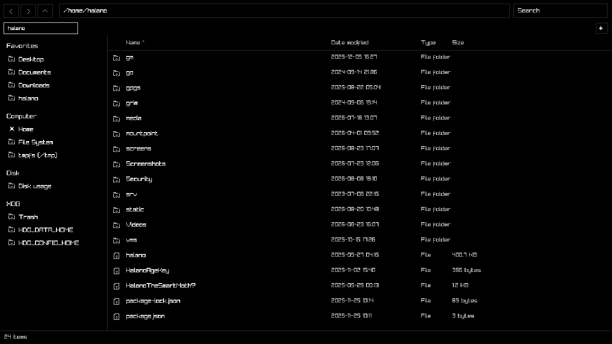
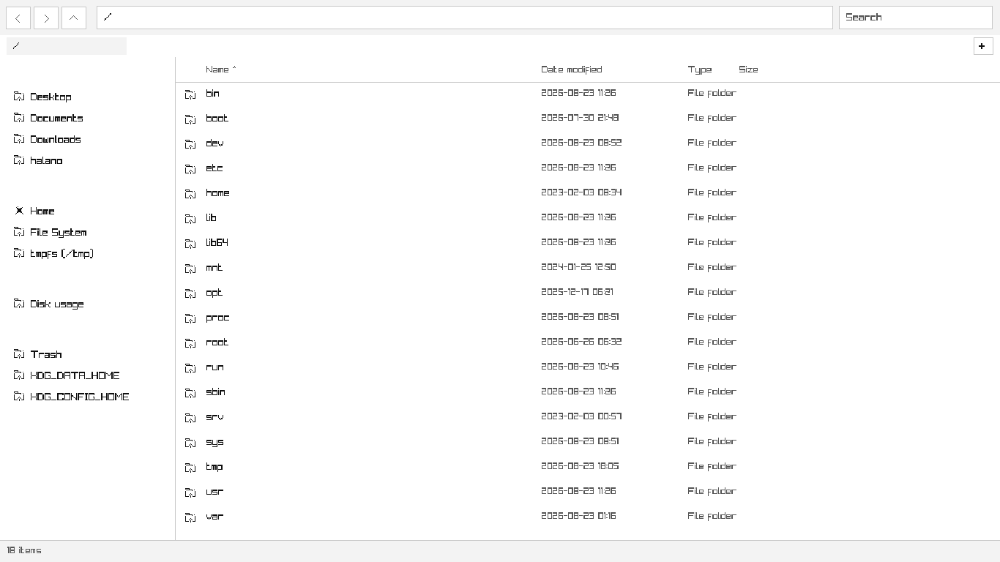
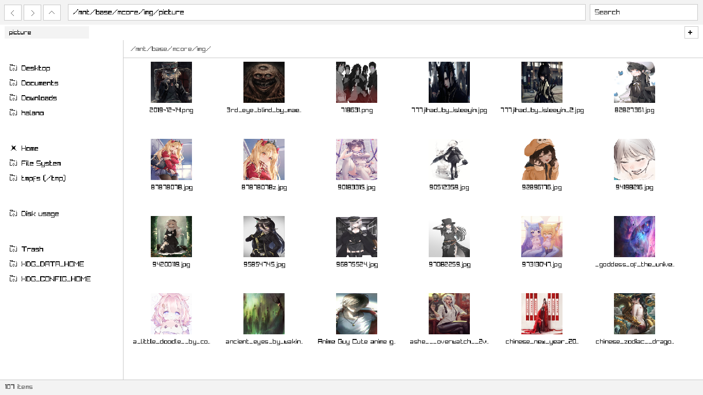
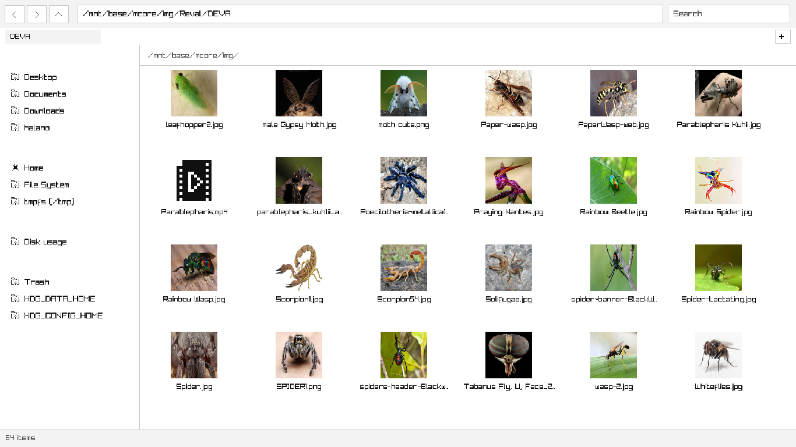
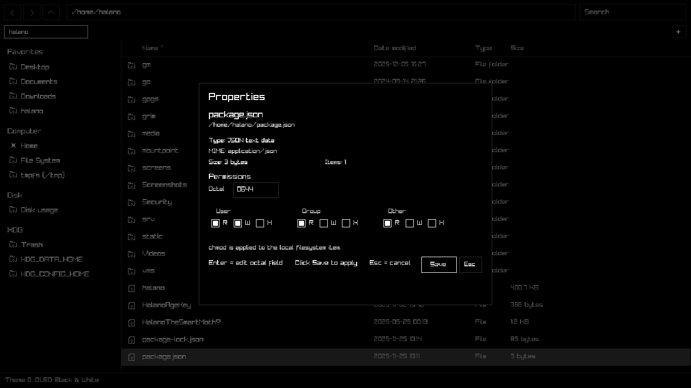
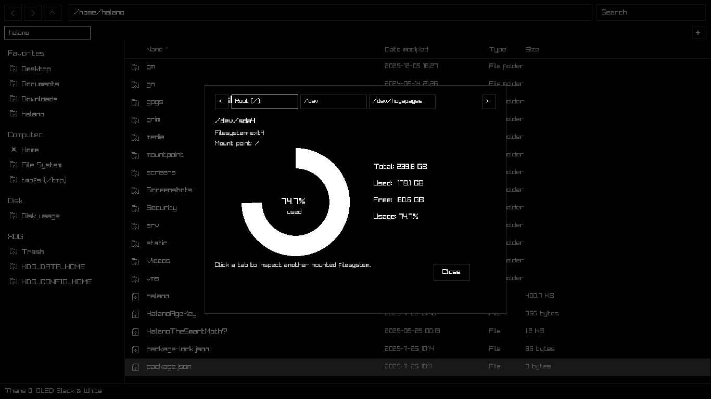
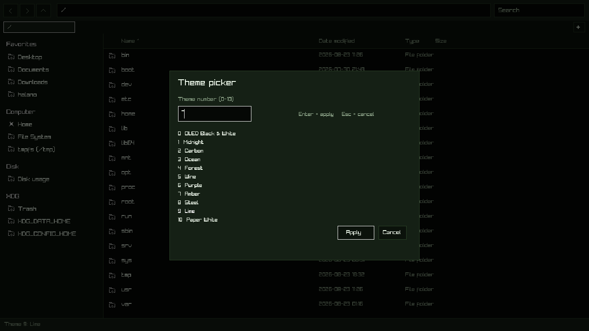
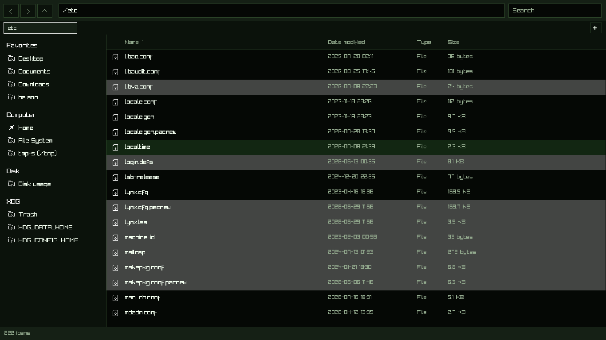
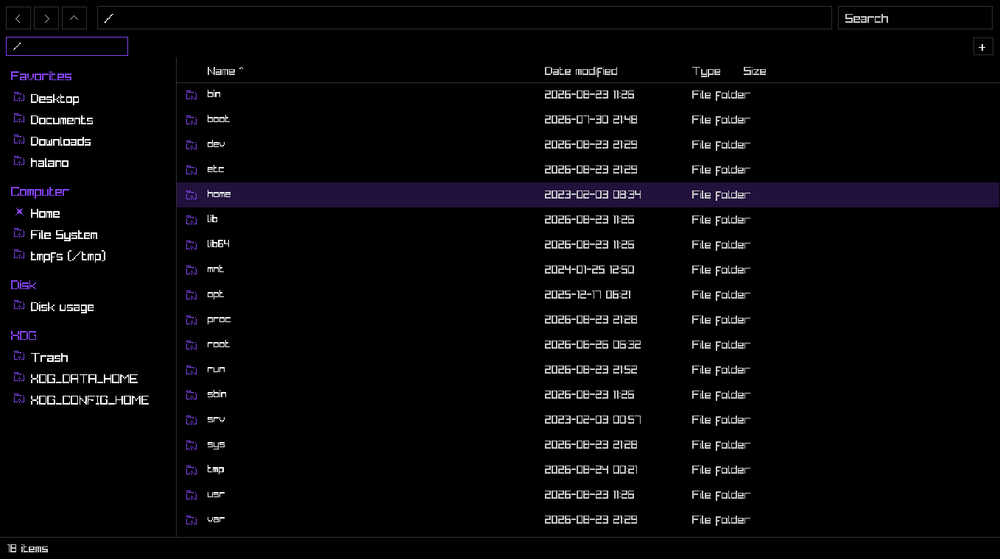
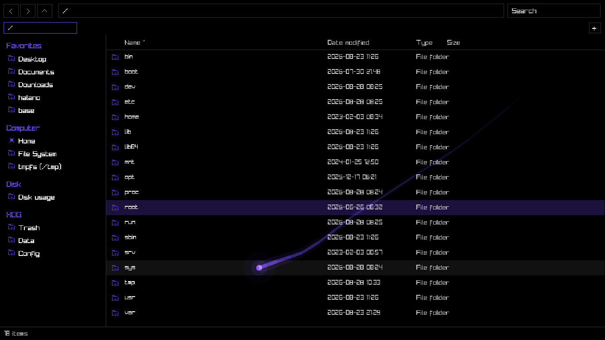

# RaymothFM
Next-Gen linux file manager Speed focused ⚡

# Features
- Blazingly Fast / optimized
- Hotkeys cover all functionality
- Built-in archiver
- Built-in image viewer
- Built-in image converter
- Built-in files checksum (md5 crc32 sha-1-256-512)
- Lighting fast/small Libvips ⚡ thumbnail rendering and image viewer (avif jxl webp png bmp jpg etc)
- Libarchive cover various archive formats / standlone /w system clis
- 7z/zstd/gz/xz/&more
- Linux Kernel **VFS** 🐧
- Libmagic it reads file headers to identify file types
- Multi-tabs
- Wildcard search
- Disk usage meter
- **Raylib UI** ✨
- Tab auto completion
- 1 Bit icons pack
- Themes
- Configurable
- hotkeys/look similar to windows file explorer
- No bloatware to slow start up open in no time.
- XDG integration
- Progressive rendering
- MIME EDITOR

# Dependency

- Libmagic
- Libvips
- Libarchive
- Raylib
- 7z
- Zstd
- C++ 20
- OpenSSL

### build 
```sh
make -j$(nproc)
```
`./raymothfm --help`\
`./raymothfm`\
`./raymothfm --mkcfg`\
`cat ~/.config/raymothfm/config`

# Screenshots

|1|2|
|----|----|
|||
|||
|||
|||





<details>
<summary>Hotkeys</summary>

|key|action|
|------|------|
|`F1`|Open keyboard shortcuts dialog|
|`F3`|Open theme / appearance dialog|
|`F4`|Open About dialog|
|`F5`|Refresh current directory|
|`F6`|Open `cat` / text or image viewer for the selected item|
|`F7`|New directory|
|`F8`|Copy current opened directory path to clipboard|
|`F9`|Open terminal in the current directory|
|`Ctrl+Q`|Quit RaymothFM|
|`Ctrl+F`|Focus search box|
|`Ctrl+L`|Focus address/path bar and select its text|
|`/`|Focus the existing path bar and place the caret at the end|
|`Ctrl+/`|Clear the path bar and focus it|
|`` ` ``|Open “Run command here” dialog|
|`Ctrl+T`|Open a new tab|
|`Ctrl+W`|Close the active tab|
|`Ctrl+Tab`|Next tab|
|`Ctrl+Shift+Tab`|Previous tab|
|`Ctrl+1` ... `Ctrl+9`|Activate tab 1 ... 9|
|`Ctrl+H`|Show / hide hidden files|
|`Ctrl+R`|Refresh current directory|
|`Ctrl+A`|Select all files in the main view; select all text when a textbox is focused|
|`Ctrl+C`|Copy selection / copy selected text in a textbox|
|`Ctrl+X`|Cut selection / cut selected text in a textbox|
|`Ctrl+V`|Paste files / paste clipboard text in a textbox|
|`Ctrl+Backspace`|Erase textbox text back to the previous `/` in path/command fields|
|`Alt+Left`|Back in directory history|
|`Alt+Right`|Forward in directory history|
|`Alt+Up`|Go to parent directory|
|`Ctrl+Home`|Go to the HOME directory|
|`Backspace`|Go to parent directory when the main view is focused|
|`Delete`|Move selected items to XDG Trash|
|`Shift+Delete`|Open permanent-delete confirmation dialog|
|`Enter`|Open selected item / confirm the active dialog action|
|`Esc`|Close the active menu/dialog or unfocus the active textbox|
|`PageUp`|Move selection upward by a page|
|`PageDown`|Move selection downward by a page|
|`Home`|Jump to the first item / move textbox cursor to the start|
|`End`|Jump to the last item / move textbox cursor to the end|
|`↑` `↓`|Move selection up/down; in icon views, move by a whole grid row|
|`←` `→`|Move selection left/right; hold for fast repeat; in textboxes, hold to move the cursor continuously|
|`1`|Details view|
|`2`|List view|
|`3`|Medium Icons view|
|`4`|Large Icons view|
|`A` ... `Z`|When the main view is focused, immediately focus Search and start the query with that letter|
|`Tab`|Autocomplete in the path bar / command dialog; advance dialog fields where supported|
|`Shift+Tab`|Move backward through supported dialog fields|
|`+` / `=`|Zoom in in the image viewer|
|`-`|Zoom out in the image viewer|
|`F`|Toggle image-viewer fit mode|
|`Ctrl+Mouse Wheel`|Cycle view mode from Details → List → Medium Icons → Large Icons|
|`Mouse Wheel`|Scroll the current view|
|`LMB + drag`|Draw a selection rectangle in the file view and select intersecting items on release|
|`Ctrl + LMB + drag`|Add rectangle-selected items to the existing selection|
|`LMB` on archive-dialog parameters|Cycle that parameter forward|
|`RMB` on archive-dialog parameters|Cycle that parameter backward|
|`LMB` on converter parameters|Cycle that parameter forward|
|`RMB` on converter parameters|Cycle that parameter backward|
|`Menu / Application key`|Open / close the context menu|
|`Middle mouse button` on a tab|Close that tab|

</details>